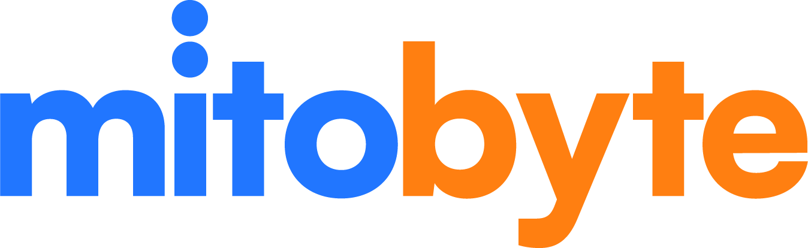



  

# Mitobyte App

Welcome to the Mitobyte App! This application is the digital hub for our tech community, allowing members to connect and access our member directory.

**Official Website:** [mitobyte.com](https://mitobyte.com/)

##  Key Features

###  Upcoming Events
Stay active and engaged! View a curated list of upcoming events promoted by our community members, sponsors, and local event organizers. Never miss an opportunity to connect and learn.

###  Active Member Directory
Unlock the power of our network. Our Active Directory tool allows verified members to browse profiles, find skills, and connect with other tech professionals in the ecosystem.

###  Live Check-ins
See where the community is gathering. With our Check-in feature, you can see who is attending which events, making it easier to find friends and colleagues at meetups.

###  In-App Form Collection
Streamline your interactions. We've integrated seamless form collection directly into the app for feedback, surveys, and event registrations, keeping everything centralized.

##  Access the App

You can use the web application directly at:
**[app.mitobyte.com](https://app.mitobyte.com)**

##  How to Join

To ensure our community remains a high-quality environment for trusted connections, access to the full member directory is by invitation only. There are two main ways to get involved and gain access:

### 1. Request an Invite via Discord
Join our Discord community to connect with us online and request an invite code. This is the quickest way to chat with current members and admins.

 **[Join the Discord Server](https://discord.gg/9upPtGdwta)**

### 2. Attend In-Person Meetups
We strongly encourage real-world connections! By registering for and attending our in-person events, you can meet the team and get added to our directory.

Find and register for our next event on:
*   **[Eventbrite](https://www.eventbrite.com/o/code-brews-collective-49824193943)**
*   **[Meetup.com](https://www.meetup.com/milwaukee-code-and-coffee/?eventOrigin=event_home_page)**

We look forward to building this community with you!

---

Powered by [Craft The Future](https://us.craftthefuture.xyz)
